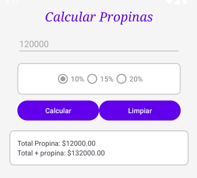

# CalculaPropina 💰

Una aplicación Android simple desarrollada en Kotlin que permite calcular propinas fácilmente.  
El usuario puede ingresar un monto y seleccionar el porcentaje de propina (10%, 15% o 20%).  
La app mostrará automáticamente el valor de la propina y el total a pagar.

## Funcionalidades 🚀

- Ingreso del monto total.
- Selección de porcentaje de propina (RadioGroup).
- Cálculo de propina y total.
- Botón para limpiar los campos.
- Validaciones y animaciones básicas.
- Cálculo encapsulado en clase utilitaria (`CalculadoraUtils.kt`).

## Tecnologías 🛠

- Kotlin
- Android SDK
- View Binding
- ConstraintLayout
- Git + GitHub
- Gradle-8.14.2
- JDK 22.0.2

## Capturas de pantalla 📱

## Cómo ejecutar el proyecto ⚙️

1. Clona este repositorio:
   
   git clone https://github.com/cbahamondesd/calculapropina.git
